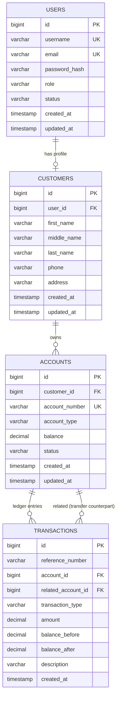

# Banking System Backend

An educational **Spring Boot 3 + MySQL + JWT** backend that simulates a small banking system. It demonstrates layered architecture, explicit parameterized SQL through `JdbcTemplate`, atomic financial transactions, concurrency safety, and role-based access control.

> ⚠️ **Educational simulator only.** No real banks, no real payment networks, no real money.

---

## Table of Contents

1. [Overview](#overview)
2. [Features](#features)
3. [Tech Stack](#tech-stack)
4. [Architecture](#architecture)
5. [Project Structure](#project-structure)
6. [Database Design](#database-design)
7. [Entity Relationship Diagram](#entity-relationship-diagram)
8. [Banking Rules](#banking-rules)
9. [Concurrency & Transaction Safety](#concurrency--transaction-safety)
10. [Authentication & Authorization](#authentication--authorization)
11. [Setup](#setup)
12. [Environment Variables](#environment-variables)
13. [Running the Application](#running-the-application)
14. [API Reference](#api-reference)
15. [Data Flow Examples](#data-flow-examples)
16. [Testing](#testing)
17. [Postman](#postman)
18. [Security Notes](#security-notes)
19. [Future Improvements](#future-improvements)

---

## Overview

This backend models the core operations of a bank:

- Users register and log in with JWT-secured sessions
- Customers manage their profile and open accounts
- Customers deposit, withdraw, and transfer money between accounts
- Every balance change produces an immutable **transaction ledger row** with `balance_before` and `balance_after`
- Transfers are **atomic** — either both legs commit, or nothing does

The **project creator** (`MikeyD`) is seeded at startup as **`SUPER_ADMIN`**, giving them power to promote users to `ADMIN`, deactivate accounts, and inspect any account. A middle **`ADMIN`** tier can freeze/unfreeze accounts and view everything without modifying roles.

### Role Capability Matrix

| Action | CUSTOMER | ADMIN | SUPER_ADMIN |
|---|:---:|:---:|:---:|
| Register / login | ✅ | ✅ | ✅ |
| Manage own profile | ✅ | ✅ | ✅ |
| Create own accounts | ✅ | ✅ | ✅ |
| Deposit / withdraw / transfer (own) | ✅ | ✅ | ✅ |
| View own transaction history | ✅ | ✅ | ✅ |
| View **all** customers & accounts | ❌ | ✅ | ✅ |
| Freeze / unfreeze / close **any** account | ❌ | ✅ | ✅ |
| View **any** account's transaction history | ❌ | ✅ | ✅ |
| Promote `CUSTOMER` → `ADMIN` | ❌ | ❌ | ✅ |
| Demote `ADMIN` → `CUSTOMER` | ❌ | ❌ | ✅ |
| Activate / deactivate / lock any user | ❌ | ❌ | ✅ |
| Create or modify `SUPER_ADMIN` | ❌ | ❌ | ❌ (single seeded instance only) |

---

## Features

- **Authentication:** JWT (HS256) + BCrypt password hashing
- **Authorization:** `@PreAuthorize` + service-layer ownership checks (defence in depth)
- **Layered architecture:** Controller → Service → Repository → SQL
- **Explicit SQL:** all queries in `*Repository.java` using `NamedParameterJdbcTemplate`
- **Immutable ledger:** every balance change writes a `transactions` row
- **Atomic transfers:** one `@Transactional` boundary, two ledger rows
- **Concurrency-safe:** conditional UPDATE with row-count verification + `SELECT ... FOR UPDATE`
- **Validation:** Jakarta Bean Validation on all request DTOs
- **Centralized exceptions:** `@RestControllerAdvice`, clean JSON, no stack traces leaked
- **Reproducible schema:** Flyway migrations `V1`–`V7`
- **Tested:** 12 unit + integration tests including transfer rollback

---

## Tech Stack

| Layer | Technology |
|---|---|
| Language | Java 21 |
| Framework | Spring Boot 3.3.x |
| Build | Maven |
| Web | Spring MVC |
| Persistence | Spring JDBC (`NamedParameterJdbcTemplate`) — **no JPA** |
| Security | Spring Security + JWT (`io.jsonwebtoken`) |
| Password hashing | BCrypt |
| Validation | Jakarta Bean Validation |
| Database | MySQL 8 |
| Migrations | Flyway |
| Testing | JUnit 5, Mockito, AssertJ, Spring Boot Test, H2 (test profile) |

---

## Architecture

```
CLIENT
  ↓ HTTP
CONTROLLER   →  validates request, wraps response in ApiResponse
  ↓
SERVICE      →  business rules, @Transactional boundaries
  ↓
REPOSITORY   →  explicit parameterized SQL
  ↓
DATABASE
```

**Rules enforced throughout the codebase:**
- Controllers never contain SQL or business rules
- Repositories never contain business rules
- Services own transaction boundaries (`@Transactional`)
- DTOs shield the API from internal models
- All monetary values are `BigDecimal` end to end

---

## Project Structure

```
src/main/java/com/bank/bankingsystem/
├── BankingSystemApplication.java
├── config/          JdbcConfig, SecurityConfig, SuperAdminSeeder
├── controller/      Auth, Customer, Account, Transfer, Transaction, Admin, SuperAdmin
├── dto/
│   ├── request/     RegisterRequest, LoginRequest, TransferRequest, ...
│   └── response/    ApiResponse, AuthResponse, AccountResponse, ...
├── exception/       Custom exceptions + GlobalExceptionHandler
├── model/           User, Customer, Account, Transaction (POJOs)
│   └── enums/       Role, UserStatus, AccountType, AccountStatus, TransactionType
├── repository/      UserRepository, CustomerRepository, AccountRepository, TransactionRepository
├── security/        JwtService, JwtAuthenticationFilter, CustomUserDetailsService, ...
├── service/         *Service interfaces
│   └── impl/        *ServiceImpl classes
└── util/            AccountNumberGenerator, CurrentUserUtil
```

---

## Database Design

### `users`
| Column | Type | Notes |
|---|---|---|
| id | BIGINT PK | auto-increment |
| username | VARCHAR(50) UNIQUE | |
| email | VARCHAR(120) UNIQUE | |
| password_hash | VARCHAR(100) | BCrypt |
| role | VARCHAR(20) | `CUSTOMER` / `ADMIN` / `SUPER_ADMIN` |
| status | VARCHAR(20) | `ACTIVE` / `INACTIVE` / `LOCKED` |
| created_at, updated_at | TIMESTAMP | |

### `customers`
| Column | Type | Notes |
|---|---|---|
| id | BIGINT PK | |
| user_id | BIGINT FK → users(id) | UNIQUE, CASCADE |
| first_name, middle_name, last_name | VARCHAR | |
| phone | VARCHAR(20) | |
| address | VARCHAR(255) | |
| created_at, updated_at | TIMESTAMP | |

### `accounts`
| Column | Type | Notes |
|---|---|---|
| id | BIGINT PK | |
| customer_id | BIGINT FK → customers(id) | RESTRICT |
| account_number | VARCHAR(20) UNIQUE | 10 digits, backend-generated |
| account_type | VARCHAR(20) | `SAVINGS` / `CHECKING` |
| balance | DECIMAL(19,4) | CHECK `>= 0` |
| status | VARCHAR(20) | `ACTIVE` / `FROZEN` / `CLOSED` |
| created_at, updated_at | TIMESTAMP | |

### `transactions`
| Column | Type | Notes |
|---|---|---|
| id | BIGINT PK | |
| reference_number | VARCHAR(40) | indexed; **shared** between transfer legs |
| account_id | BIGINT FK → accounts(id) | RESTRICT |
| related_account_id | BIGINT FK → accounts(id) | nullable, SET NULL |
| transaction_type | VARCHAR(20) | `DEPOSIT` / `WITHDRAWAL` / `TRANSFER_IN` / `TRANSFER_OUT` |
| amount | DECIMAL(19,4) | CHECK `> 0` |
| balance_before, balance_after | DECIMAL(19,4) | |
| description | VARCHAR(255) | |
| created_at | TIMESTAMP | |

**Indexes** — see `V5__create_indexes.sql` + `V7__relax_transaction_reference.sql`:
- `users(role)`, `users(status)`
- `customers(last_name)`, `customers(phone)`
- `accounts(customer_id)`, `accounts(status)`, `accounts(account_type)`
- `transactions(account_id, created_at DESC)`, `transactions(transaction_type)`, `transactions(related_account_id)`, `transactions(reference_number)`

---

## Entity Relationship Diagram



---

## Banking Rules

- **Money:** always `BigDecimal` in Java, `DECIMAL(19,4)` in SQL. Never `float`/`double`.
- **Amounts:** must be strictly positive. Zero and negative are rejected by Bean Validation **and** service-layer checks.
- **Withdrawals:** rejected if `amount > balance`.
- **Transfers:** rejected if `source == destination`.
- **Account states:**
  - `ACTIVE` — normal operations allowed
  - `FROZEN` — no deposits, withdrawals, or transfers
  - `CLOSED` — terminal; nothing allowed
- **Ownership:** a `CUSTOMER` can only act on their own accounts. `ADMIN`/`SUPER_ADMIN` can act on any.
- **Account numbers:** generated by the backend, 10 digits, unique, never derived from the DB `id`.
- **Ledger immutability:** transaction rows are append-only; nothing updates or deletes them.

---

## Concurrency & Transaction Safety

The banking-critical flows use **two layers** of protection:

### 1. Atomic conditional UPDATE (primary strategy)

```sql
UPDATE accounts
SET    balance = balance - :amount
WHERE  id = :id
  AND  status = 'ACTIVE'
  AND  balance >= :amount;
```

The `AND balance >= :amount` clause means the database itself refuses to overdraw. The service checks `rowsAffected`:

```java
int rows = accountRepository.debit(accountId, amount);
if (rows == 0) {
    throw new InsufficientBalanceException("Insufficient balance");
}
```

This defeats the classic race:
```
Thread A: SELECT balance → 100
Thread B: SELECT balance → 100
Thread A: UPDATE ... = 100 - 60  ← balance now 40
Thread B: UPDATE ... = 100 - 60  ← would go negative → 0 rows affected → rejected
```

### 2. Pessimistic row locking for transfers

Transfers need to touch **two** accounts atomically. Two improvements on top of (1):

- **`SELECT ... FOR UPDATE`** locks both account rows inside the transaction.
- **Deterministic lock order** (lowest `id` first) prevents deadlock between two concurrent transfers in opposite directions.

```java
Long lowId  = Math.min(src.getId(), dst.getId());
Long highId = Math.max(src.getId(), dst.getId());

Account a = accountRepository.findByIdForUpdate(lowId).orElseThrow();
Account b = accountRepository.findByIdForUpdate(highId).orElseThrow();
```

### 3. Single transaction boundary

The entire transfer — debit, credit, both ledger inserts — is inside one `@Transactional` method. Any exception triggers a full rollback. The integration test `transfer_rollsBackDebitWhenCreditFails` **proves** this.

---

## Authentication & Authorization

### Login flow

```
CLIENT                              SERVER
  │                                    │
  │  POST /api/auth/login              │
  │  {usernameOrEmail, password}       │
  ├───────────────────────────────────►│
  │                                    │  UserRepository.findByUsernameOrEmail
  │                                    │  BCrypt.matches(password, hash)
  │                                    │  JwtService.generateToken(user)
  │  ◄─────────────────────────────────┤
  │  { token: "eyJhbGc...",            │
  │    tokenType: "Bearer",            │
  │    expiresInMs: 3600000,           │
  │    userId, username, email, role } │
```

### Authenticated request

```
CLIENT                              SERVER
  │                                    │
  │  GET /api/accounts                 │
  │  Authorization: Bearer eyJhbGc...  │
  ├───────────────────────────────────►│
  │                                    │  JwtAuthenticationFilter
  │                                    │    parse token
  │                                    │    load user via CustomUserDetailsService
  │                                    │    populate SecurityContext
  │                                    │  Controller → Service → Repository
  │  ◄─────────────────────────────────┤
  │  { success: true, data: [...] }    │
```

### JWT claims

| Claim | Meaning |
|---|---|
| `sub` | username |
| `uid` | user id |
| `email` | user email |
| `role` | `CUSTOMER` / `ADMIN` / `SUPER_ADMIN` |
| `iss` | `Banking_System` |
| `iat`, `exp` | issued at / expiration |

### Defence in depth

- **Filter chain (`SecurityConfig`)** blocks unauthenticated requests and role-mismatched ones at `/api/admin/**` and `/api/super-admin/**`.
- **Method security (`@PreAuthorize`)** re-checks role on controllers.
- **Service layer** verifies ownership before any balance operation; throws `UnauthorizedAccountAccessException` → 403.

A `CUSTOMER` cannot access another customer's account even if they guess the account id.

### Public endpoints

Only:
- `POST /api/auth/register`
- `POST /api/auth/login`

Everything else requires `Authorization: Bearer <token>`.

---

## Setup

### Prerequisites

- Java 21+
- Maven 3.9+
- MySQL 8+

### 1. Create the database

```bash
sudo mysql <<'SQL'
CREATE DATABASE IF NOT EXISTS banking_system_db
    CHARACTER SET utf8mb4 COLLATE utf8mb4_unicode_ci;

CREATE USER IF NOT EXISTS 'banking_app'@'localhost'
    IDENTIFIED BY 'ChangeMe_StrongPass_123!';

GRANT ALL PRIVILEGES ON banking_system_db.* TO 'banking_app'@'localhost';
FLUSH PRIVILEGES;
SQL
```

### 2. Clone and configure

```bash
git clone <your-repo-url> Banking_System
cd Banking_System
cp .env.example .env
# edit .env with real values
```

### 3. Build

```bash
mvn clean package
```

### 4. Run

```bash
./run-app.sh
```

Or, without the helper script:

```bash
set -a; source .env; set +a
mvn spring-boot:run
```

Flyway will apply migrations on first boot, and the **SuperAdmin seeder** will create `MikeyD` from the `SUPER_ADMIN_*` environment variables.

---

## Environment Variables

| Variable | Example | Purpose |
|---|---|---|
| `DB_URL` | `jdbc:mysql://localhost:3306/banking_system_db?useSSL=false&serverTimezone=UTC` | JDBC URL |
| `DB_USERNAME` | `banking_app` | DB user |
| `DB_PASSWORD` | *(secret)* | DB password |
| `SERVER_PORT` | `8080` | HTTP port |
| `JWT_SECRET` | *(≥32 chars)* | HS256 signing key |
| `JWT_EXPIRATION_MS` | `3600000` | Token lifetime (1 h) |
| `SUPER_ADMIN_USERNAME` | `MikeyD` | Seeded once at first boot |
| `SUPER_ADMIN_EMAIL` | `mikeyD@bank.com` | |
| `SUPER_ADMIN_PASSWORD` | *(secret)* | BCrypt-hashed at startup |
| `ACCOUNT_NUMBER_PREFIX` | `10` | Account number prefix |
| `ACCOUNT_NUMBER_LENGTH` | `10` | Total digits |
| `FLYWAY_ENABLED` | `true` | |
| `FLYWAY_BASELINE_ON_MIGRATE` | `true` | |

**`.env` is git-ignored.** Only `.env.example` is committed.

---

## Running the Application

```bash
./run-app.sh
```

Expected log:

```
BankingHikariPool - Start completed.
Flyway ... Successfully applied 7 migrations ... now at version v7
Replaced SUPER_ADMIN placeholder with BCrypt hash from env.
Tomcat started on port 8080 (http) with context path '/'
Started BankingSystemApplication in 4.028 seconds
```

---

## API Reference

Base URL: `http://localhost:8080`

All responses use this envelope:

```json
{
  "success": true,
  "message": "…",
  "data": { … },
  "timestamp": "2026-09-23T22:00:00"
}
```

Errors:

```json
{
  "success": false,
  "message": "Insufficient balance",
  "timestamp": "2026-09-23T22:00:00"
}
```

### Auth

| Method | Endpoint | Auth | Body |
|---|---|---|---|
| POST | `/api/auth/register` | public | `{username, email, password, firstName, middleName?, lastName, phone?, address?}` |
| POST | `/api/auth/login` | public | `{usernameOrEmail, password}` |

### Customer

| Method | Endpoint | Auth | Purpose |
|---|---|---|---|
| GET | `/api/customers/me` | any | Own profile |
| PUT | `/api/customers/me` | any | Update own profile |

### Accounts

| Method | Endpoint | Auth | Purpose |
|---|---|---|---|
| POST | `/api/accounts` | any | Create account |
| GET | `/api/accounts` | any | List own accounts |
| GET | `/api/accounts/{accountId}` | any | Get own account by id |
| GET | `/api/accounts/number/{accountNumber}` | any | Get by account number |
| GET | `/api/accounts/{accountId}/balance` | any | Balance |
| POST | `/api/accounts/{accountId}/deposit` | any | Deposit |
| POST | `/api/accounts/{accountId}/withdraw` | any | Withdraw |
| GET | `/api/accounts/{accountId}/transactions` | any | History (paged) |

### Transfers

| Method | Endpoint | Auth | Body |
|---|---|---|---|
| POST | `/api/transfers` | any | `{sourceAccountNumber, destinationAccountNumber, amount, description?}` |

### Transactions

| Method | Endpoint | Auth | Purpose |
|---|---|---|---|
| GET | `/api/transactions/{referenceNumber}` | any (owner/admin) | Look up by reference — returns both legs of a transfer |
| GET | `/api/transactions/id/{transactionId}` | any (owner/admin) | Legacy numeric lookup |

### Admin

| Method | Endpoint | Auth |
|---|---|---|
| GET | `/api/admin/users` | ADMIN+ |
| GET | `/api/admin/customers` | ADMIN+ |
| GET | `/api/admin/accounts` | ADMIN+ |
| GET | `/api/admin/accounts/{accountId}/transactions` | ADMIN+ |
| PATCH | `/api/admin/accounts/{accountId}/status` | ADMIN+ |

### SuperAdmin

| Method | Endpoint | Auth |
|---|---|---|
| GET | `/api/super-admin/users` | SUPER_ADMIN |
| POST | `/api/super-admin/users/{userId}/promote` | SUPER_ADMIN |
| POST | `/api/super-admin/users/{userId}/demote` | SUPER_ADMIN |
| PATCH | `/api/super-admin/users/{userId}/status` | SUPER_ADMIN |

### Status codes used

| Code | Meaning |
|---|---|
| 200 | OK |
| 201 | Created |
| 400 | Bad request / validation / insufficient balance |
| 401 | Missing or invalid JWT |
| 403 | Authenticated but not permitted (wrong role / not owner) |
| 404 | Resource not found |
| 409 | Duplicate username / email |
| 500 | Unexpected error (logged, generic message returned) |

---

## Data Flow Examples

### Deposit flow

```
CLIENT
  ↓ POST /api/accounts/{id}/deposit  { amount, description }
CONTROLLER (TransactionController via AccountController)
  ↓ validate
SERVICE (TransactionServiceImpl.deposit) @Transactional
  ├── check ownership + account ACTIVE
  ├── SELECT ... FOR UPDATE       (row lock)
  ├── UPDATE balance = balance + amount
  ├── INSERT transactions (DEPOSIT, before, after)
  └── commit
  ↓
DATABASE
  ↓ response
```

### Transfer flow (flagship)

```
CLIENT
  ↓ POST /api/transfers  { sourceAccountNumber, destinationAccountNumber, amount, description? }
CONTROLLER (TransferController)
  ↓ validate
SERVICE (TransferServiceImpl.transfer) @Transactional
  ├── reject if source == destination
  ├── resolve both accounts (reject if not found, not ACTIVE)
  ├── check ownership of source
  ├── SELECT ... FOR UPDATE on min(id), then max(id)   ← deadlock-free
  ├── verify source.balance >= amount
  ├── UPDATE accounts SET balance = balance - amount
  │     WHERE id = src AND status='ACTIVE' AND balance >= amount
  │     → 0 rows → throw → ROLLBACK
  ├── UPDATE accounts SET balance = balance + amount
  │     WHERE id = dst AND status='ACTIVE'
  │     → 0 rows → throw → ROLLBACK (source debit undone)
  ├── INSERT transactions (TRANSFER_OUT, ref, before, after)
  ├── INSERT transactions (TRANSFER_IN, same ref, before, after)
  └── commit
  ↓
DATABASE
  ↓ response { referenceNumber, sourceAccountNumber, destinationAccountNumber,
              amount, sourceBalanceAfter, destinationBalanceAfter }
```

If **any** step fails, the DB is exactly as it was before the transfer started. Proven by `TransferRollbackIntegrationTest`.

---

## Testing

```bash
mvn test
```

Expected:

```
Tests run: 12, Failures: 0, Errors: 0, Skipped: 0
BUILD SUCCESS
```

### Test coverage

| Test class | Type | Covers |
|---|---|---|
| `AccountServiceTest` | Unit (Mockito) | Create account, missing customer profile |
| `TransactionServiceTest` | Unit (Mockito) | Deposit success, withdraw success, insufficient balance, frozen account |
| `TransferServiceTest` | Unit (Mockito) | Same-account rejection, non-positive amount, ownership check, success path, insufficient source balance |
| `AuthServiceIntegrationTest` | Integration (`@SpringBootTest` + H2) | Register, duplicate username, wrong password |
| `TransferRollbackIntegrationTest` | Integration | **Rollback of source debit when destination credit fails** |

---

## Postman

Import `postman/Banking_System.postman_collection.json` and `postman/Banking_System.postman_environment.json`.

### Suggested execution order

1. **Register customer** → captures `customerToken`, `customerId`
2. **Login customer** → refreshes `customerToken`
3. **Login superadmin** (`MikeyD`) → captures `superAdminToken`
4. **Create account** → captures `accountId`
5. **Deposit 1000** → captures `referenceNumber`
6. **Check balance** → 1000.0000
7. **Withdraw 250** → 750.0000
8. **Transfer 100 to second customer** — create second customer + account first
9. **Look up transaction by reference** → both legs of a transfer
10. **Deposit to nonexistent account** → 404
11. **Withdraw 999999** → 400 Insufficient balance
12. **Call `/api/accounts` without token** → 401
13. **Call `/api/super-admin/users` with customer token** → 403

---

## Security Notes

- Passwords hashed with BCrypt (strength 10)
- JWT signed with HS256; secret must be ≥32 bytes
- No credentials in source; `.env` is git-ignored
- SQL is parameterized everywhere — no string concatenation of user input
- Exception responses never leak stack traces, SQL, or hashes
- `@PreAuthorize` + service-layer ownership = defence in depth
- Only one `SUPER_ADMIN` can exist; seeded once, no API can create another

---

## Future Improvements

- Refresh tokens + logout blacklist
- Account statements (PDF/CSV export)
- Scheduled transfers
- Interest calculation for SAVINGS accounts
- Two-factor authentication
- Full OpenAPI / Swagger UI
- Testcontainers for MySQL-backed integration tests
- Docker Compose for zero-config local setup